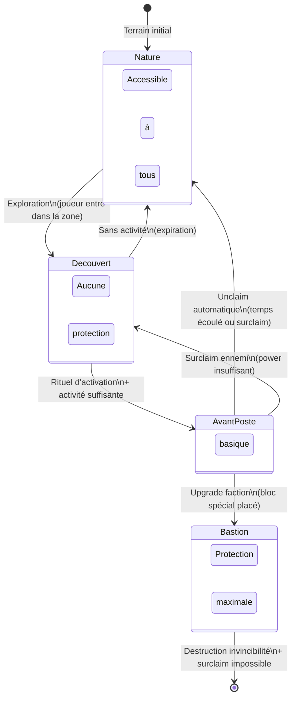

import { Card, CardGrid, Aside } from '@astrojs/starlight/components';

Le système de claims définit comment les factions contrôlent et protègent leur territoire. Il existe quatre types de zones avec des niveaux de protection et des règles différents.

## Vue d'ensemble des types de claims

| Type | Protection | Surclaim | Permanent |
|---|---|---|---|
| **Nature** | Aucune | N/A | N/A |
| **Découvert** | Aucune | ✅ Toujours | ❌ |
| **Avant-Poste** | Basique | ✅ Si power insuffisant | ❌ (temporaire) |
| **Bastion** | Maximum | ❌ Jamais | ✅ |

## Cycle de vie d'un claim

## Coût d'un claim

- **1 claim = 20 power** requis
- Maximum **25 chunks** par faction de 20 joueurs

## Affichage sur la minimap

Les différents types de claims apparaissent sur la minimap avec des couleurs distinctes pour faciliter la navigation et la stratégie.

<Aside type="tip">
Protégez votre Bastion en priorité — c'est votre base principale et elle ne peut pas être surclaimed !
</Aside>

## Sections détaillées

<CardGrid>
  <Card title="Nature" icon="open-book">
    Zones naturelles non claimées.
    [En savoir plus →](/starlight/claims/nature/)
  </Card>
  <Card title="Découvert" icon="map">
    Zones explorées sans protection réelle.
    [En savoir plus →](/starlight/claims/decouvert/)
  </Card>
  <Card title="Avant-Poste" icon="star">
    Claim classique avec protection basique.
    [En savoir plus →](/starlight/claims/avant-poste/)
  </Card>
  <Card title="Bastion" icon="rocket">
    Super claim — votre base principale, imprenable.
    [En savoir plus →](/starlight/claims/bastion/)
  </Card>
</CardGrid>
