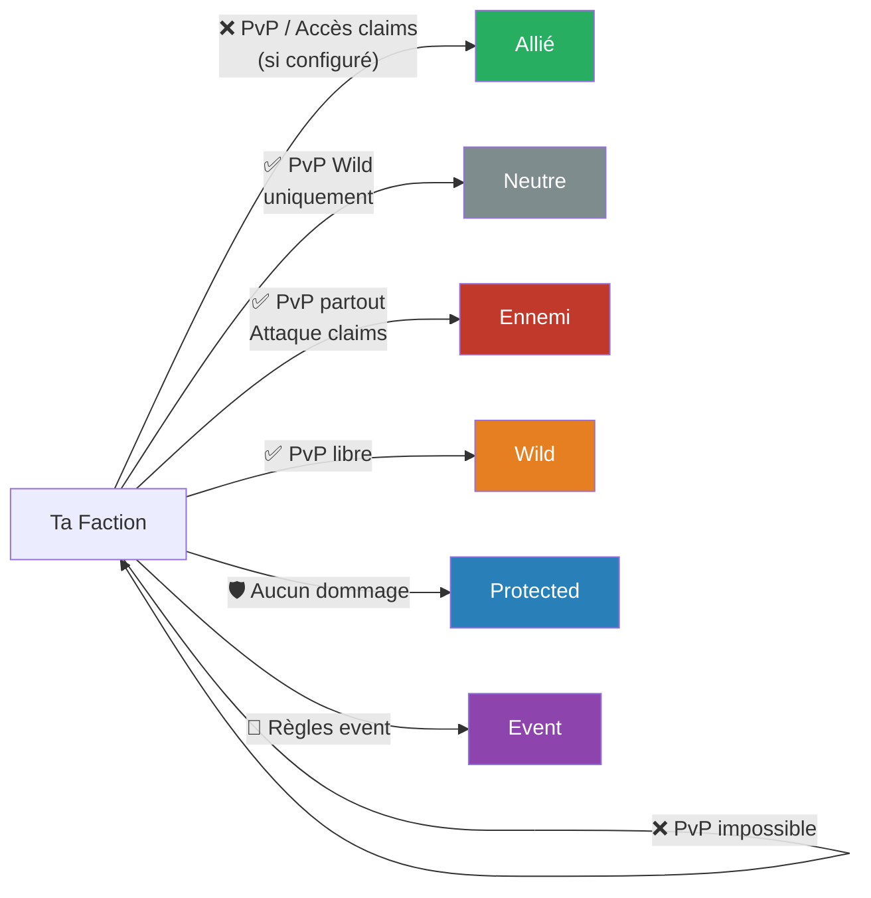

import { Aside } from '@astrojs/starlight/components';

Les factions peuvent établir différents types de relations entre elles, influençant les règles de PvP et d'accès aux territoires.

## Types de relations

| Relation | Description |
|---|---|
| **Allié** | Faction amie — pas de PvP, accès possible aux claims (si configuré) |
| **Faction** | Membres de votre propre faction — aucun PvP possible |
| **Ennemi** | Faction hostile — PvP activé, peut attaquer les claims |
| **Neutre** | Pas de relation établie — PvP possible selon la zone |
| **Wild** | Zones sauvages sans claim — PvP activé pour tous |
| **Event** | Zone d'événement temporaire — règles spécifiques à l'événement |
| **Protected** | Zone protégée (ex : spawn, zones admin) — aucun PvP, aucun dommage |

## Graphe des relations



## Règles de PvP par relation

| Contre | PvP possible ? |
|---|---|
| Faction (soi-même) | ❌ |
| Allié | ❌ par défaut |
| Neutre | ✅ (zones Wild uniquement) |
| Ennemi | ✅ partout hors Protected |
| Wild | ✅ |
| Event | Selon règles de l'événement |
| Protected | ❌ |

## Gestion des relations

Les relations sont gérées par le **Chef** ou les **Officiers** :

```
/f ally [faction]      → Proposer une alliance
/f enemy [faction]     → Déclarer la guerre
/f neutral [faction]   → Revenir neutre
```

<Aside type="note">
Une alliance nécessite l'accord des deux factions. Une déclaration de guerre est unilatérale.
</Aside>

## Accès aux claims alliés

Par défaut, les alliés n'ont **pas accès** aux claims d'une faction. L'accès peut être activé manuellement par un officier ou le chef pour certaines zones ou types de permissions.
