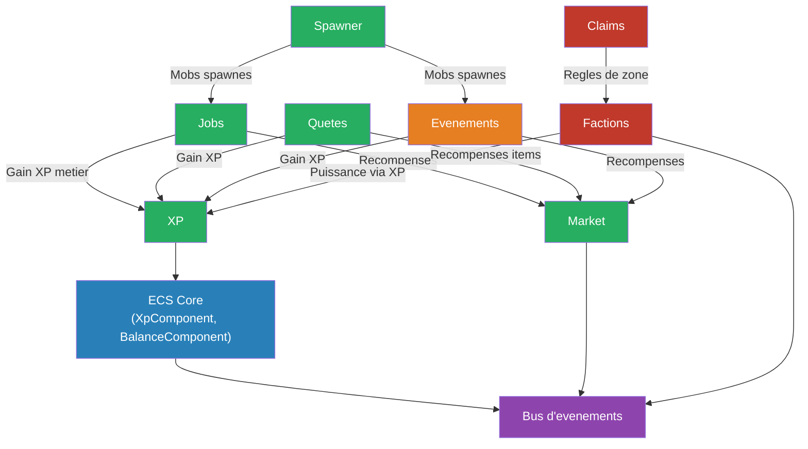

import { Badge } from '@astrojs/starlight/components';

Le serveur GOAT utilise un ensemble de plugins personnalisés pour enrichir l'expérience de jeu.

## État des plugins

| Plugin | État | Description |
|---|---|---|
| [XP](/starlight/plugins/xp/) | <Badge text="Terminé" variant="success" /> | Système d'expérience générique |
| [Market](/starlight/plugins/market/) | <Badge text="Terminé" variant="success" /> | Économie et échanges |
| [Spawner](/starlight/plugins/spawner/) | <Badge text="Terminé" variant="success" /> | Spawners personnalisés |
| [Jobs](/starlight/plugins/jobs/) | <Badge text="Terminé" variant="success" /> | Métiers et progression |
| [Quêtes](/starlight/plugins/quetes/) | <Badge text="Terminé" variant="success" /> | Système de quêtes |
| [Événements](/starlight/plugins/events/) | <Badge text="En cours" variant="caution" /> | KOTH, boss, événements spéciaux |
| Monde | <Badge text="En cours" variant="caution" /> | Mondes minage / farm / event |

## Architecture

Tous les plugins partagent un composant ECS (Entity Component System) commun qui gère :
- Les données XP des joueurs
- Les méthodes d'ajout/retrait d'XP
- La communication entre plugins via un bus d'événements

Cette architecture permet à des plugins comme les **Factions** et les **Jobs** d'utiliser le même système d'XP sans duplication de code.

## Diagramme d'interactions

> **Vert** = développé ✅ | **Orange** = en cours 🚧 | **Rouge** = planifié 📋
